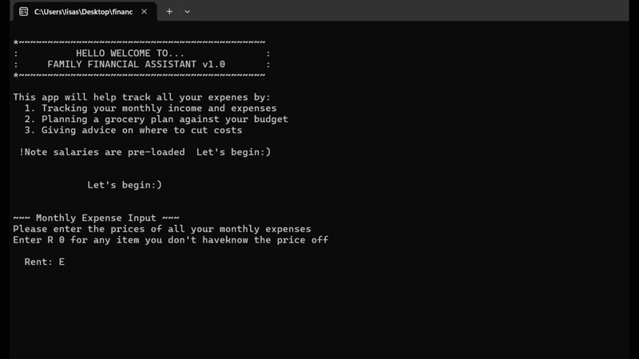

# Family Financial Assistant
This is a C++ console-based financial tool that helps families track monthly income, plan expenses, build grocery lists, and receive budget advice with results saved to a local report file.
It's built as a personal project to apply **C++ fundamentals**, **data structures**, and **algorithmic thinking** to a real-world problem.

# Why I Built This
Managing a family budget involves real logic problems:
? How can you keep track of every little expense?
? How do you know if you can afford groceries before you overspend?
? How do you identify which expense to cut first when money is tight?

# Data Structures & Algorithms Used

This project was a practical exercise in applying DSA concepts:

- **Structs** groups related data
- **Linear search O(n)** looks through the expense array to find the maximum value
- **Loop-based accumulation** summing arrays without the use of built-in functions, but instead, by iteration
- **File streams**  `ofstream` for writing structured reports

# How to Run

### Option 1 — Dev-C++ (Windows, easiest)
1. Download [Dev-C++](https://sourceforge.net/projects/orwelldevcpp/)
2. File → New → Project → Console Application → C++
3. Add all files to the project
4. compile and run

# Future Improvements

 ~ Load salaries/get user input from instead of hardcoding
 ~ Add a monthly history, compare this month vs last month
 ~ Use a linked list instead of a fixed array for unlimited expense entries
 ~ Add a savings goal tracker

